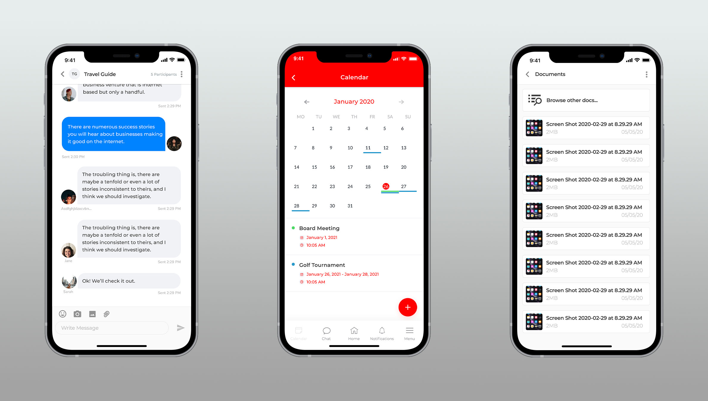

<h1 align="center">
  Alexandru Vasiliu - iOS Portfolio
</h1>

    <a href="mailto:alexg.vasiliu@gmail.com">Email Me</a>  · 
    <a href="https://github.com/ab492/iOS-Portfolio/blob/master/Andy%20Brown%20-%20iOS%20Developer%20-%20July%202019.pdf">Download Resume</a>  ·
    <a href="https://alexvasiliu.me/">Website</a>

## Connect Plus
[Connect Plus](https://nepservices.com/) is an iOS application made specifically for the Law Enforcement, Firefighters and Sheriff Labor Organisations. It acts as a secured platform where communication, event calendar, news feed and document libraries are brought together in order to provide a complete experience to its users. The 1:1 and group chat has a high degree of security as the rest of the app, since it works with sensitive and national security data.

##### 🔨Technologies: SwiftUI, Combine, MVVM, Bitrise, Notifications, No third party libraries.

 

