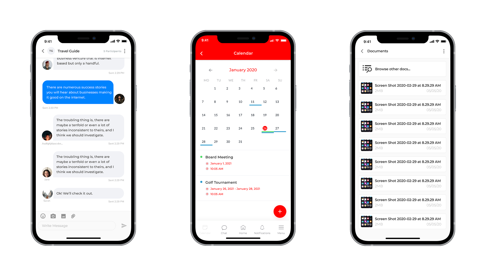
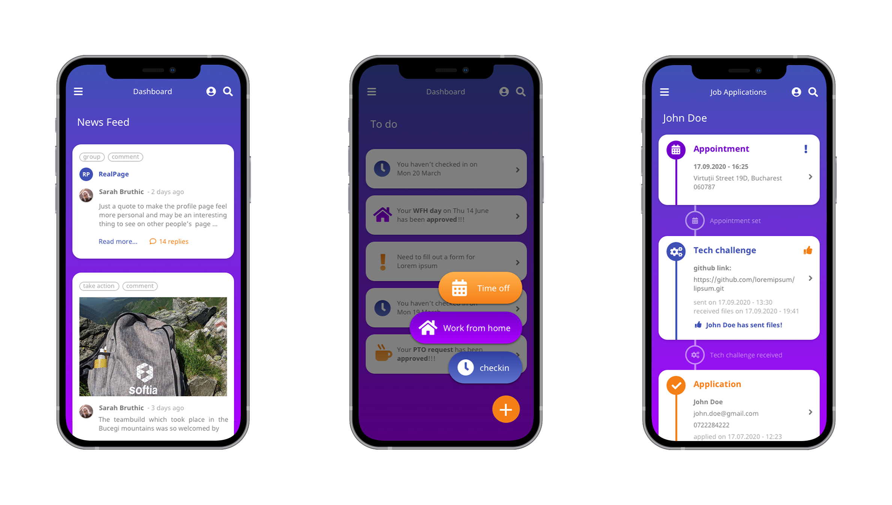
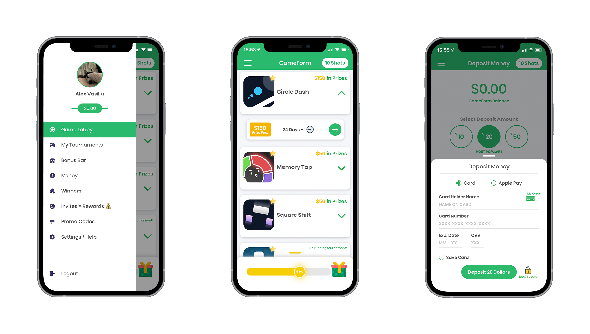

<h1 align="center">
  Alexandru Vasiliu - iOS Portfolio
</h1>
 

    <a href="mailto:alexg.vasiliu@gmail.com">Email Me</a>  · 
    <a href="https://github.com/ab492/iOS-Portfolio/blob/master/Andy%20Brown%20-%20iOS%20Developer%20-%20July%202019.pdf">Download CV</a>  ·
    <a href="https://alexvasiliu.me/">Website</a>

 
I'm Alex, an iOS developer and technical consultant based in Bucharest. I have been programming since when I was 16, started my first job as a developer at 19 years old and at 23 graduated as an Engineer in Robotics, Automatic Control of Industrial Machines and Computer Science.
 

I have a wealth of experience working with clients from all around the world. The work I provide is of the highest quality, fully responsive, and tested in a wide range of devices. I take great care to ensure each project is well-architected, well-documented and easily maintainable so you can enhance an app as your company grows. I maintain a high code quality standard. Writing code that is documented and easy to read means it can be maintained and scaled in the future and allows co-workers to quickly work with it.
 

I've been developing natively in Swift for years. I believe that native apps give the best results and have the least problems when it comes to adopting new iOS features, iOS versions or when new devices are released. I also have direct experience with Apple's policies, device capabilities and account management procedures alongside with a good understanding of what it takes to maintain apps over the long term. 
 

My Projects: 
 

- [Software](#connect-plus)
    - [Connect Plus](#connect-plus)
    - [Worklin](#worklin)
    - [GameForm](#gameform)
- [Games](#games)
    - [Command-line tool](#command-line-tool)
    - [Xcode source editor extension](#xcode-source-editor-extension)
    - [Xcode build phase](#xcode-build-phase)
    - [Via Applescript](#via-applescript)
    - [VSCode plugin](#vscode-plugin)
    - [Sublime Text plugin](#sublime-text-plugin)
    - [Git pre-commit hook](#git-pre-commit-hook)
    - [On CI using Danger](#on-ci-using-danger)

## Connect Plus
[Connect Plus](https://nepservices.com/) is an application made specifically for the Law Enforcement, Firefighters and Sheriff Labor Organisations. It acts as a secured platform where communication, event calendar, news feed and document libraries are brought together in order to provide a complete experience to its users. The 1:1 and group chat has a high degree of security as the rest of the app, since it works with sensitive and national security data.

##### 🔨 Technologies Used: Swift, MVVM, Service-Oriented Architecture, REST API, Keychain, MapKit, Alamofire, Pusher, UnitTest

  
<b>More details about technologies used</b>

  
  * Fully written in Swift
  * MVVM design pattern with Service-Oriented architecture
  * SwiftFormat for code formatting
  * Nuke for image loading and caching
  * Phone number Login with SMS verification code
  * Calendar for events
  * Keychain to store user credentials and sensitive data
  * Data sources independent from ViewControllers
  * REST API alongside Postman, Insomnia, Docker and pgAdmin
  * Local notifications and Push Notifications with Firebase
  * MapKit and CoreLocation alongside Google Maps API for geotargeting, geocoding and reverse geocoding
  * Realtime Messaging using Pusher
  * Networking Layer using Alamofire
  * UnitTest for algorithms and REST API  

 
 

## Worklin
[Worklin](https://softia.ro/) is a cross-platform application for managing the complete range of a company's needs. It contains features as time-tracking, time-off and PTO requests, documents management and others. For HR and administrative employees, it also serves as a reporting tool and all is needed in terms of legal documents.

##### 🔨 Technologies Used: Swift, MVVM, Service-Oriented Architecture, REST API, Keychain, Alamofire, UnitTest

  
<b>More details about technologies used</b>

  
  * Fully written in Swift
  * MVVM design pattern with Service-Oriented architecture
  * SwiftFormat for code formatting
  * Keychain to store user credentials and sensitive data
  * Data sources independent from ViewControllers
  * REST API alongside Insomnia, Docker and pgAdmin
  * Local notifications
  * Networking Layer using Alamofire
  * UnitTest for algorithms and REST API  
  * Fluid animations for Tap gestures
  * Custom PacMan loading screen while waiting for API response
  * Versatile Side Menu navigator

 
 

## GameForm
[GameForm](https://apps.apple.com/us/app/gameform-play-games-for-money/id1439757695) is a new gaming platform that allows you to play games for cash! Its aim is to become the Netflix style destination where you can play simple games for cash prizes and win money online. The model is simple: select a game from the lobby, pay the entry fee and play for the high score. All games are skill-based which means users can get better the more they play. Through features like Bonus Bar and Refer a Friend, you get access to more rewards on a daily and weekly basis.

##### 🔨 Technologies Used: Swift, REST API, ApplePay, Analytics, Biometrics

  
<b>More details about technologies used</b>

  
  * MVC with Decorator design patern
  * SwiftFormat for code formatting
  * Apple, Google and Phone number Login with SMS verification code
  * REST API alongside Postman
  * Local notifications and Push Notifications
  * Fund account with Credit Card or Apple Pay
  * Track user activity with Analytics
  * Deep Linking using Branch.io
  * biometric authentication with Face and Touch ID
  * Share and invite with message or email

 
 

DriveMag
AllDelicious & SoDelicious
Tubidy & Tubify
Adblock & Parental Control Pro
EvoMag
