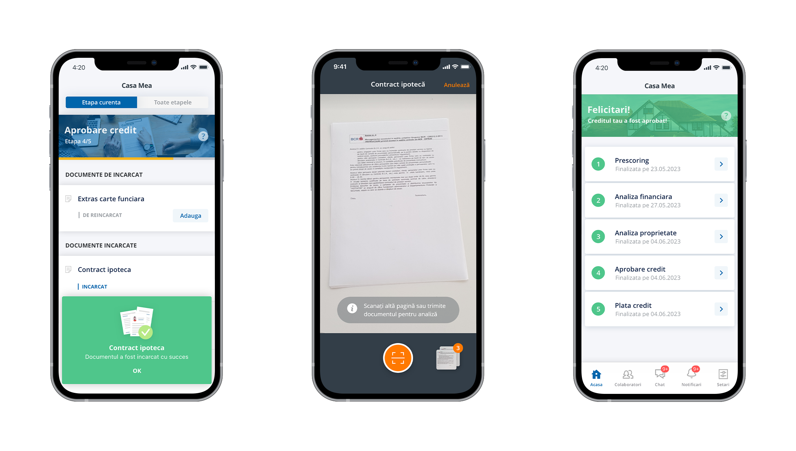
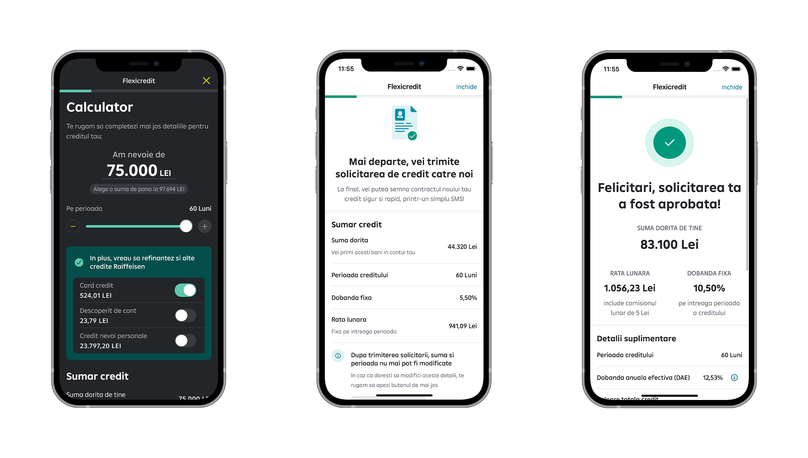
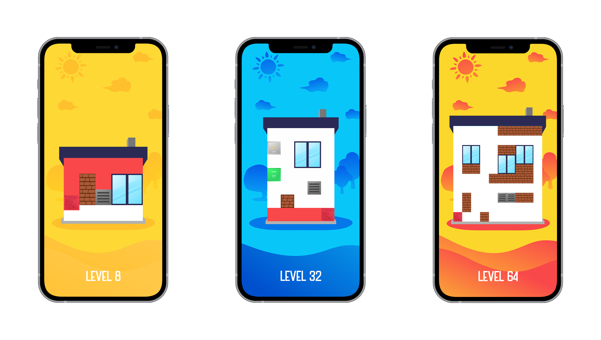

<h1 align="center">
  Alexandru Vasiliu - iOS Portfolio
</h1>
 

    <a href="mailto:alexg.vasiliu@gmail.com">Email Me</a>  · 
    <a href="https://github.com/avasiliu-ro/iOS-portfolio/blob/main/AlexVasiliuCV.pdf">Download CV</a>  ·
    <a href="https://www.linkedin.com/in/alex-vasiliu/">LinkedIn</a>  ·
    <a href="https://alexvasiliu.me/">Website</a>

 
I'm Alex, an iOS architect and technical consultant based in Bucharest. I have been programming since when I was 16, started my first job as a developer at 20 years old and at 23 graduated as an Engineer in Robotics, Automatic Control of Industrial Machines and Computer Science.
  

I have a wealth of experience working with clients from all around the world. The work I provide is of the highest quality, fully responsive, and tested in a wide range of devices. I take great care to ensure each project is well-architected, well-documented and easily maintainable so you can enhance an app as your company grows. I maintain a high code quality standard. Writing code that is documented and easy to read means it can be maintained and scaled in the future and allows co-workers to quickly work with it.
  

I've been developing natively in Swift & SwiftUI for almost 8 years. I believe that native apps give the best results and have the least problems when it comes to adopting new iOS features, iOS versions or when new devices are released. I also have direct experience with Apple's policies, device capabilities and account management procedures alongside with a good understanding of what it takes to maintain apps over the long term. 
  

My latest projects
  

- Software
    - [John Lewis](#jl)
    - [Mobility+](#mobility) 
    - [Casa Mea](#casa-mea) 
    - [Smart Mobile](#smart-mobile)
    - [myAsirom](#myAsirom)
    - [Utilio](#utilio)
    - [Connect Plus](#connect-plus)
    - [Worklin](#worklin)
    - [GameForm](#gameform)
    - [Tubidy](#tubidy)
    - [AllDelicious & SoDelicious](#alldelicious--sodelicious)
    - [Adblock](#adblock)
- Games
    - [Squares](#squares)
    - [Shapes](#shapes)
    - [Inno's Adventures](#innos-adventures)
    - [Moonbear Smash](#moonbear-smash)  
    - [Baseball Run](#baseball-run)  
    - [Memory Tap](#memory-tap)  
    - [Hell's Kitchen](#hells-kitchen)  
    - [House Painter](#house-painter)
    - [Circle Rush](#circle-rush)
    - [Tricky Disc](#tricky-disc)
    - [Square Dash](#square-dash)
    - [Circle Dash](#circle-dash)
    
 

## John Lewis
[John Lewis]([https://apps.apple.com/fr/app/enbw-mobility/id1232210521?l=en](https://apps.apple.com/gb/app/john-lewis-partners/id486502369))'s app integrates cutting-edge technology, offering a seamless shopping experience with over 300,000 products. Features include Augmented Reality (AR) for product visualization, personalized digital membership benefits, and push notifications for promotions. It supports digital receipts, barcode scanning for instant product details, and real-time stock checks. Compliant with rigorous privacy standards, the app secures your data while offering a seamless user experience.

##### 🔨 Technologies Used: UIKit - MVP, SwiftUI - MVVM, Coordinator, Swift Package Manager, Docker, BFF, Vapor, REST API, Modern Concurrrency, Adobe Analytics, Dark Mode, Voice Over, Dynamic Text, Unit Tests, Snapshot tests, SwiftLint, Figma

  
<b>More details about technologies used</b>

  
  * Developed in UIKit with MVP design pattern
  * New flows implemented in SwiftUI with MVVM design patern
  * Coordinator for navigation management
  * Swift Package Manager for managing the distribution of code
  * Azure DevOps for automated builds, testing and release
  * REST API alongside Postman
  * Dark Mode option for low-light environments
  * PromiseKit for asynchronous code execution
  * Lokalise for multiple dynamic languages
  * Fakery generating mock data for unit tests
  * Firebase for Crashlytics, Analytics and Dynamic Links
  * Lottie for native rendering of high-quality animations
  * Nimble for expecting outcomes
  * Unit Tests for Domain and API layer
  * SwiftLint to enforce style and conventions for code formatting
  * Figma for wireframes and visual design

 
 

## Mobility+
[EnBW mobility+](https://apps.apple.com/fr/app/enbw-mobility/id1232210521?l=en) is the smart all-in-one solution for your eMobility. Our Electric Vehicle (EV) copilot allows you to easily find charging stations and charge your EV via App, charging card or AutoCharge with a very simple payment process. Our interactive map makes it easy for you to find free charging stations for electric cars in your area. With Apple CarPlay, the app can be easily connected to the display in your car. 

##### 🔨 Technologies Used: UIKit - MVP, SwiftUI - MVVM, Coordinator, Swift Package Manager, Azure DevOps, REST API, Dark Mode, PromiseKit, Lokalise, Fakery, Firebase, Lottie, Nimble, Unit Tests, SwiftLint, Figma

  
<b>More details about technologies used</b>

  
  * Developed in UIKit with MVP design pattern
  * New flows implemented in SwiftUI with MVVM design patern
  * Coordinator for navigation management
  * Swift Package Manager for managing the distribution of code
  * Azure DevOps for automated builds, testing and release
  * REST API alongside Postman
  * Dark Mode option for low-light environments
  * PromiseKit for asynchronous code execution
  * Lokalise for multiple dynamic languages
  * Fakery generating mock data for unit tests
  * Firebase for Crashlytics, Analytics and Dynamic Links
  * Lottie for native rendering of high-quality animations
  * Nimble for expecting outcomes
  * Unit Tests for Domain and API layer
  * SwiftLint to enforce style and conventions for code formatting
  * Figma for wireframes and visual design

 
 

## Casa Mea
[Casa Mea](https://apps.apple.com/ro/app/casa-mea/id1440617077) is the service offered by BCR for customers of CASA Mea mortgages and BPL advance credit, which allows users to upload documents related to the lending process in an online platform, in order to manage the documents, as well as chat communication and permanent information of users regarding the stage where they are, the next steps and the average time until the loan process ends.

##### 🔨 Technologies Used: UIKit, CLEAN, REST API, Alamofire, SwiftLint, Figma

  
<b>More details about technologies used</b>

  
  * Developed in UIKit
  * CLEAN architecture design pattern
  * REST API alongside Postman
  * Networking Layer using Alamofire
  * SwiftLint to enforce style and conventions for code formatting
  * Figma for wireframes and visual design
    

 
 

## Smart Mobile
[Smart Mobile](https://apps.apple.com/ro/app/noul-raiffeisen-smart-mobile/id1255136212) is the control panel for your money. You simply login and you have access to all banking operations. In addition to mobile phone payments, transfers and invoice payments, you can always open a new account and order a new card. You can search for a payment from the past and make it again, you can shedule future payments, issue direct debit bill payments or save them into templates. In short, you can do almost any of your banking business. Through push notifications, you will find out instantly how much money goes and comes in your current account or is paid with your credit card.

##### 🔨 Technologies Used: UIKit - MVP, SwiftUI - MVVM, Swift Package Manager, Localization, REST API, Alamofire, PromiseKit, Dark Mode, SwiftLint, Figma, Jenkins, Github Actions

  
<b>More details about technologies used</b>

  
  * Developed in UIKit with MVP design pattern
  * New flows implemented in SwiftUI with MVVM design patern
  * Swift Package Manager for managing the distribution of code
  * Localization for multiple dynamic languages
  * Service-Oriented architecture
  * REST API alongside Insomnia
  * Networking Layer using Alamofire
  * PromiseKit for asynchronous code execution
  * Dark Mode option for low-light environments
  * SwiftLint to enforce style and conventions for code formatting
  * Figma for wireframes and visual design
  * Jenkins and Github actions for CI/CD
    

 
 

## myAsirom
[myAsirom](https://asirom.ro/) is a multi-platform solution dedicated to customers for acquiring online insurance products and manage their accounts. The application contains a public area from where the possible customers can acquire insurances and additional services and an internal area for enrolled customers in order to get support, make payments and manage their accounts during collaboration.

##### 🔨 Technologies Used: SwiftUI, MVVM, FlowX.AI, Socket.IO, REST API, Alamofire, Firebase, Analytics, Keychain, SwiftLint, Lottie, Zeplin

  
<b>More details about technologies used</b>

  
  * 95% SwiftUI (presentation logic) + 5% UIKit (navigation logic)
  * MVVM architecture design pattern
  * FlowX.AI generating omnichannel interfaces
  * Socket.IO for real-time and bidirectional event-based communication
  * SwiftLint to enforce style and conventions for code formatting
  * Firebase for Crashlytics and App Distribution
  * Analytics for screen tracking and event logging
  * REST API alongside Postman
  * Networking Layer using Alamofire
  * Keychain to store user credentials and sensitive data
  * Lottie for native rendering of high-quality animations
  * Zeplin for wireframes and visual design

 
 

## Utilio
[Utilio](https://omvpetrom.utilio.ro/) is a multi-platform [solution](https://www.romaniajournal.ro/business/new-digital-platform-to-accelerate-growth-in-the-sme-gas-market-through-digital-sales/) dedicated to customers and staff for acquiring natural gas products and managing the account. The application contains a public area from where the possible customers can acquire commodities and additional services and an internal area with account for enrolled customers in order to manage their accounts during collaboration.

##### 🔨 Technologies Used: UIKit, CLEAN, FlowX.AI, Socket.IO, Fastlane, REST API, Alamofire, Firebase, Analytics, Push Notifications, Keychain, SwiftLint, Charts, Lottie, SwiftMessages, Zeplin, UnitTest

  
<b>More details about technologies used</b>

  
  * CLEAN architecture design pattern
  * FlowX.AI generating omnichannel interfaces
  * Socket.IO for real-time and bidirectional event-based communication
  * Fastlane to automate testers and builds schemas for deployment
  * SwiftLint to enforce style and conventions for code formatting
  * Firebase for Crashlytics, App Distribution and Notifications
  * Analytics for screen tracking and event logging
  * REST API alongside Postman
  * Networking Layer using Alamofire
  * Keychain to store user credentials and sensitive data
  * Charts for displaying large quantities of data and the relationships between parts of data
  * Lottie for native rendering of high-quality animations
  * SwiftMessages for displaying flexible layouts on specific triggers
  * Zeplin for wireframes and visual design
  * UnitTest for algorithms and REST API

 
 

## Connect Plus
[Connect Plus](https://nepservices.com/) is an application made specifically for the Law Enforcement, Firefighters and Sheriff Labor Organisations. It acts as a secured platform where communication, event calendar, news feed and document libraries are brought together in order to provide a complete experience to its users. The 1:1 and group chat has a high degree of security as the rest of the app, since it works with sensitive and national security data.

##### 🔨 Technologies Used: Swift, MVVM, Service-Oriented Architecture, REST API, Keychain, MapKit, Alamofire, Pusher, UnitTest

  
<b>More details about technologies used</b>

  
  * MVVM design pattern with Service-Oriented architecture
  * SwiftFormat for code formatting
  * Nuke for image loading and caching
  * Phone number Login with SMS verification code
  * Calendar for events
  * Keychain to store user credentials and sensitive data
  * Data sources independent from ViewControllers
  * REST API alongside Postman, Insomnia, Docker and pgAdmin
  * Local notifications and Push Notifications with Firebase
  * MapKit and CoreLocation alongside Google Maps API for geotargeting, geocoding and reverse geocoding
  * Realtime Messaging using Pusher
  * Networking Layer using Alamofire
  * UnitTest for algorithms and REST API  

 
 

## Worklin
[Worklin](https://softia.ro/) is a cross-platform application for managing the complete range of a company's needs. It contains features as time-tracking, time-off and PTO requests, documents management and others. For HR and administrative employees, it also serves as a reporting tool and all is needed in terms of legal documents.

##### 🔨 Technologies Used: Swift, MVVM, Service-Oriented Architecture, REST API, Keychain, Alamofire, UnitTest

  
<b>More details about technologies used</b>

  * MVVM design pattern with Service-Oriented architecture
  * SwiftFormat for code formatting
  * Keychain to store user credentials and sensitive data
  * Data sources independent from ViewControllers
  * REST API alongside Insomnia, Docker and pgAdmin
  * Local notifications
  * Networking Layer using Alamofire
  * UnitTest for algorithms and REST API  
  * Fluid animations for Tap gestures
  * Custom PacMan loading screen while waiting for API response
  * Versatile Side Menu navigator

 
 

## GameForm
[GameForm](https://apps.apple.com/us/app/gameform-play-games-for-money/id1439757695) is a new gaming platform that allows you to play games for cash! Its aim is to become the Netflix style destination where you can play simple games for cash prizes and win money online. The model is simple: select a game from the lobby, pay the entry fee and play for the high score. All games are skill-based which means users can get better the more they play. Through features like Bonus Bar and Refer a Friend, you get access to more rewards on a daily and weekly basis.

##### 🔨 Technologies Used: Swift, REST API, ApplePay, Analytics, Biometrics

  
<b>More details about technologies used</b>

 
  * MVC with Decorator design patern
  * SwiftFormat for code formatting
  * Apple, Google and Phone number Login with SMS verification code
  * REST API alongside Postman
  * Local notifications and Push Notifications
  * Fund account with Credit Card or Apple Pay
  * Track user activity with Analytics
  * Deep Linking using Branch.io
  * Biometric Authentication with Face and Touch ID
  * Share and invite with message or email

 
 

## Tubidy
[Tubidy](https://apps.apple.com/us/app/tubidy-fm-radio-music-player/id1355464544) is the perfect application for listening the music you love with more than 70,000 radio stations from 210 countries. You can listen to top radio stations, music, news, sports, talk and comedy and create your own playlists. You can even see the recently played songs on the radio. Search by country, by genre, by state or by city and listen to all that music in the background. Don’t forget you can always bring your media files from your cloud provider.

##### 🔨 Technologies Used: Swift, Cloud, Download, Localization

  
<b>More details about technologies used</b>

  
  * Store, Download files from cloud services like Dropbox, iCloud, Google Drive
  * Develop an internal Download library with Torrent-like behaviour
  * Localization based on device language
  * Custom Views
  

 
 

## AllDelicious & SoDelicious
[AllDelicious](https://apps.apple.com/us/app/alldelicious-new-food-recipes-shopping-list/id1109702043) & [SoDelicious](https://apps.apple.com/us/app/sodelicious-quick-delicious-cooking-recipes-for-food/id1109702047) is your new cooking coach! With over 4000 Tasty recipes now at your fingertips, an innovative Step-By-Step instruction mode, a ‘Favourite Recipes’ page which serves as your very own mobile cookbook, and an incredible Search tool that allows you to filter by any ingredients, cuisine and social occasion you’re in the mood for. You can also create, organize and share you recipe collection to make finding favorite recipes a snap.

##### 🔨 Technologies Used: Objective-C, AFNetworking, Ads, SQLite

  
<b>More details about technologies used</b>

  
  * Networking Layer using AFNetworking
  * Ads from different providers
  * Interrogate, Update database with SQLite
  * Custom Views

 
 

## Adblock
[Adblock](https://appadvice.com/app/adblock-parental-control-pro/1170239725) is the perfect choice if you don't want to see ads. Not only is the completely free and has over 50 million users across all browsers, but with its easy setup and the built-in blocking functions, you will save battery life by only loading the content you care about. It will block all ads, including the ones from Youtube, Facebook, Instagram and everywhere else. Its blazing-fast, has automagical updates and an optimized block lists from our own, dedicated server.

##### 🔨 Technologies Used: Objective-C, SQLite

  
<b>More details about technologies used</b>

  
  * Interrogate, Update database with SQLite
  * Custom Views
  

 
 

## Squares
[Squares](https://apps.apple.com/us/app/facebook/id1525345975) is the game where you have to get your fingers ready for the ultimate gaming experience. While it’s easy to learn, it's hard to master. Tap and swipe the squares, complete levels, challenge your friends and much more. It does not matter if you are a professional or a beginner, Squares is for anyone to enjoy. With 3 different game modes, 6 different type of squares and lots of skins and themes, every level will be a fun challenge.

##### 🔨 Technologies Used: Swift, SpriteKit, Facebook, Firebase Storage, OneSignal, In-App Purchase, CryptoSwift, TodayWidget, QuickActions

  
<b>More details about technologies used</b>

  
  * SpriteKit framework with Decorator design pattern
  * Facebook login and user information
  * Firebase Cloud Storage for user progress and data
  * Push Notification with OneSignal for holiday rewards and cross promotion
  * In-App Purchase for acquiring currency and cosmetics
  * AES256-bit local data encryption with CryptoSwift
  * TodayWidget with collapsed/expanded view to display user progress
  * 3D-Touch Quick Actions 
  * Calendar algorithm for Daily Rewards
  * Fluid animations and transitions with SKAction
  * Compatibility for all current and upcoming devices
  

 
 

## Shapes
[Shapes](https://vimeo.com/339986401) is an arcade game crafted for players with all ages. Its simple concept using only familiar gestures like tapping and swiping allows it for an easy gameplay with intuitive interactions and a straightforward navigation. You can play it on your way to work, while waiting for the coffee or when you’re bored. The Daily Rewards feature will grant you extra rewards like cubes, skins and even themes.

##### 🔨 Technologies Used: Swift, SpriteKit, Facebook, Firebase Storage, OneSignal, In-App Purchase, CryptoSwift

  
<b>More details about technologies used</b>

  
  * SpriteKit framework with Decorator design pattern
  * Facebook login and user information
  * Firebase Cloud Storage for user progress and data
  * Push Notification with OneSignal for holiday rewards and cross promotion
  * In-App Purchase for acquiring currency and cosmetics
  * AES256-bit local data encryption with CryptoSwift
  * Calendar algorithm for Daily Rewards
  * Fluid animations and transitions with SKAction
  * Compatibility for all current and upcoming devices
  

 
 

## Inno's Adventures
[Inno's Adventures](https://apps.apple.com/ro/app/innos-adventures/id1410708691) is a fun drag-and-drop puzzle game for kids. Completely hand-drawn in watercolor with hilarious sounds effects, it's like an interactive children's book. The game focuses on helping Inno and his friends in a series of childhood adventures: preparing for kindergarten, enjoying their treehouse, helping the animals in the garden, dressing up for Halloween and many others. With easy to understand drag-and-drop movements, you can chose which objects fit the best with the characters and which are not. Repeat the levels on and on just to have fun hearing the funny cartoon sounds.

##### 🔨 Technologies Used: Swift, SpriteKit, In-App Purchase, CryptoSwift

  
<b>More details about technologies used</b>

  
  * SpriteKit framework
  * In-App Purchase to unlock additional levels
  * AES256-bit local data encryption with CryptoSwift
  * Fluid animations and transitions with SKAction
  * Adjusting and processing the audio files 
  * Compatibility for all current and upcoming devices
  

 
 

## Moonbear Smash
[Moonbear Smash](https://apps.apple.com/us/app/moonbear-smash/id1289157255) is the game where you will meet the toughest and the hungriest bear in the forest. The mission is simple, under the moonlight, smash with its head smash the tree and collect as much honey as you can. Watch the time carefully, it goes faster every time! Discover the secret power ups, complete challenges and earn honey to buy new skins.

##### 🔨 Technologies Used: Swift, SpriteKit, In-App Purchase, CryptoSwift, Twitter, GameCenter, Local Notifications

  
<b>More details about technologies used</b>

  
  * SpriteKit framework
  * Share gameplay screenshots of your best score on Twitter
  * AES256-bit local data encryption with CryptoSwift
  * Fluid animations and transitions with SKAction
  * Calendar algorithm for Daily Rewards
  * Local Notifications on a daily/weekly basis
  * Leaderboards/Achievements with GameCenter
  * Compatibility for all current and upcoming devices

 
 

## Baseball Run
[Baseball Run](https://apps.apple.com/ro/app/baseball-run-smash/id1333497818) is the perfect game to play on your way to work, while waiting for the coffee or when you’re bored. With a simple tap concept of switch the direction of the ball, collects as many points and power ups before the bat hits you. Currency spawns rarely but it’s vital for unlocking new skins. Challenge your friends and climb as high as you can on the leaderboard.

##### 🔨 Technologies Used: Swift, SpriteKit, CryptoSwift, GameCenter, Local Notifications

  
<b>More details about technologies used</b>

  
  * SpriteKit framework
  * AES256-bit local data encryption with CryptoSwift
  * Fluid animations and transitions with SKAction
  * Calendar algorithm for Daily Rewards
  * Local Notifications on a daily/weekly basis
  * Leaderboards/Achievements with GameCenter
  * Compatibility for all current and upcoming devices
  

 
 

## Memory Tap
[Memory Tap](https://alexvasiliu.me/memory-tap) is a remake of the classical Simon game from the 80s, a simple yet fun memory game of colors. The player must repeat certain patterns that the are displayed in the form blinking lights. The difficulty increases as you progress with lots of different levels and combinations. Not only it will boost your brain but it's also an excellent way to build divided attention and improve processing speed.

##### 🔨 Technologies Used: Swift, SpriteKit

  
<b>More details about technologies used</b>

  
  * SpriteKit framework with Decorator design pattern
  * Fluid animations and transitions with SKAction
  * Compatibility for all current and upcoming devices
  

 
 

## Hell's Kitchen
[Hell's Kitchen](https://apps.apple.com/us/developer/mobiletech-software/id950274806) follows chef Gordon Ramsay in his cuisine where he tries to prepare a dish. You, as an orange, must run away from his knife and fight for your survival. Powerups like chilly or an ice will slow him down and win you some extra precious seconds. Challenge your friends and see who can beat the chef.

##### 🔨 Technologies Used: Swift, SpriteKit, Ads

  
<b>More details about technologies used</b>

  
  * SpriteKit framework
  * Fluid animations and transitions with SKAction
  * Compatibility for all current and upcoming devices
  * Banner, Interstitial and Reward Videos from different providers
  

 
 

## House Painter
[House Painter](https://alexvasiliu.me/house-painter) is the game where you can bring color to your walls. With a simple swipe gestures, you can control the roller right, left, up and down to fill the empty spots. The levels will get more and more complicated as you pain. so calculate your moves and try to come up with the best route. Gather enough gold sponges and you can buy different skins with different colors.

##### 🔨 Technologies Used: Swift, SpriteKit

  
<b>More details about technologies used</b>

  
  * SpriteKit framework with Decorator design pattern
  * Fluid animations and transitions with SKAction
  * Compatibility for all current and upcoming devices
  

 
 

## Circle Rush
[Circle Rush](https://codecanyon.net/item/circle-rush-native-ios-130-mobile-game-app-iphone-11-corona/26027476) is a challenging yet addictive game where you have to tap in order to switch the direction of the circle. Dodge the incoming obstacles and collect as many points as you can. Currency spawns rarely, but it’s vital for purchasing new skins and themes. Time each tap carefully but don’t wait too long! It looks easy but it becomes more challenging with every obstacle you avoid. See how long you can survive!

##### 🔨 Technologies Used: Swift, SpriteKit, Ads, GameCenter

  
<b>More details about technologies used</b>

  
  * SpriteKit framework with Decorator design pattern
  * Fluid animations and transitions with SKAction
  * Leaderboards with GameCenter
  * Banner, Interstitial, Reward Videos from different ad providers
  * Compatibility for all current and upcoming devices
  

 
 

## Tricky Disc
[Tricky Disc](https://codecanyon.net/item/tricky-disc-native-ios-mobile-game-app/24388461) is a simple yet challenging arcade game. With a simple tap to fire the disc, aim for the green circles and destroy as many as you can. Time each tap carefully but don’t wait too long! It looks easy it but becomes more challenging with every circle you destroy. Gold circles spawn rarely but they are vital in purchasing new skins and themes.

##### 🔨 Technologies Used: Swift, SpriteKit, Ads, Local Notifications

  
<b>More details about technologies used</b>

  
  * SpriteKit framework with Decorator design pattern
  * Fluid animations and transitions with SKAction
  * Local notifications for daily/weekly rewards
  * Banner, Interstitial, Reward Videos from different ad providers
  * Compatibility for all current and upcoming devices
  

 
 

## Square Dash
[Square Dash](https://alexvasiliu.me/square-dash)  is the perfect game to play on your way to work, while waiting for the coffee or when you’re bored. With a simple tap left or right concept, switch the position of your squares. Avoid the collision with the incoming obstacles and collects the points. Challenge your friends and climb as high as you can on the leaderboard

##### 🔨 Technologies Used: Swift, SpriteKit, GameCenter

  
<b>More details about technologies used</b>

  
  * SpriteKit framework with Decorator design pattern
  * Fluid animations and transitions with SKAction
  * Leaderboard/Achievements with GameCenter
  * Compatibility for all current and upcoming devices
  

 
 

## Circle Dash
[Circle Dash](https://codecanyon.net/item/circle-dash-native-ios-130-mobile-game-app-iphone-11-corona/27538831) is a challenging yet addictive game where you have to tap when the colored circle reaches the center of the gray point. Time each tap carefully and avoid colliding into the walls! Currency spawns rarely, but it’s vital for purchasing new skins and themes. It looks easy but it becomes more challenging with every point collected. See how long you can survive!

##### 🔨 Technologies Used: Swift, SpriteKit, Ads, Push Notifications

  
<b>More details about technologies used</b>

  
  * SpriteKit framework with Decorator design pattern
  * Fluid animations and transitions with SKAction
  * Cross promotion with Push Notifications
  * Banner, Interstitial, Reward Videos from different ad providers
  * Compatibility for all current and upcoming devices
  

 
 
